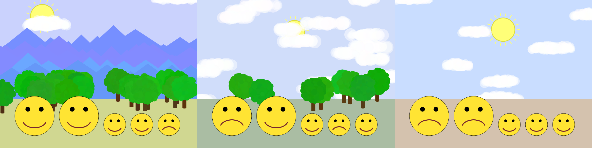

Comp 127: Emoji Family Vacation Lab
====

Your emojis are going on vacation!

Overview
---

You start this lab with an existing project, which gives you some nice building blocks for creating landscapes. You create a landscape, put your emojis in the landscape, then fill out scenery to create a slide show of emoji family vacation photos that are similar to the ones above.

Setup
---

Please carefully follow the [**COMP 127 Homework / Take-Home Exercise Procedure**](https://comp127.innig.net/resources/take-home-procedure/). Don’t miss any steps!

Tasks
---

1. Look through existing code in the `EmojiVacation` class. Read the method signatures (the top line of a method declaring the name, return type, and parameters) to understand which methods are available and what they do. You do not need to understand in depth how each one is actually implemented. (Abstraction!)
2. Run `EmojiVacation` and see what it produces. Notice that it draws no mountains or trees. Modify the `generateVacationPhoto()` method to draw mountains 50% of the time and trees 60% of the time.
    - _Hint:_ Look in the class for a method that will help you make something happen a certain percent of the time.
    - _Hint:_ The scene can contain both mountains and trees, or just one, or neither.
3. Copy your `Emoji` class from the emoji activity into the `emojiVacation` package. There is also a `ProvidedEmojis` class that has some already-working emoji code, in case you didn’t get a chance to make many emojis during the activity — or in case you just want more to choose from! You can use emojis from both classes.
4. Back in the `EmojiVacation` class, in `generateVacationPhoto()`, add code to iterate through the `family` list and add each item in it to the canvas. Run the code. You should see two emojis, floating in the upper left of the sky, one on top of the other.
5. Fix the `positionFamily()` method so that it positions the emojis in a neat row. Read the comments in that method for details on exactly where the emojis should be. (Note that you already have emojis in this method; you just need to change their positions.) Run the code again, and you should see two emojis next to each other, in a reasonable position at the lower left of the screen.
6. Now change the `createFamily()` method so that instead of always generating one adult and one child, it respects the `adultCount` and `childCount` parameters. Run the code, and you should see an emoji family with 2 adults and 3 kids. (Why? Where does the code specify 2 and 3? Trying testing it with other numbers.)
7. Now let’s mix it up! Change `createRandomEmoji()` so that instead of always returning a smiley face, it randomly chooses one of the many different emojis you have available. Run the code again, and you should get a different mix of family moods every time.
8. Modify the `doSlideShow` method to create a slide show of different vacation pictures. This will require creating an infinite loop that does the following:
    - Call `generateVacationPhoto()`.
    - Tell the canvas to draw the graphics immediately, instead of waiting for your code to finish. (If you don’t do this, it will wait for you to be done — and since you’re creating an infinite loop, you’ll never be done!)
    - Pause the program for three seconds.
    - Remove all of the graphical objects on the canvas, so that you have a blank canvas for the next time through the loop.
    - _Hint:_ Look carefully at the CanvasWindow documentation for methods to help you do this.

Optional Challenge Tasks
---

- Add buildings or other new scenery that appears with a random chance.
- Make the screen briefly go dark between scenes, to give a “slide projector” effect. (`NO_SLIDE_COLOR` is there to help you with this.)
- Modify the `createFamily()` method to display the adults and children in a random order. Make sure to keep the correct numbers of adults and children!
- Make different times of day. (A moon is hard to draw with the tools comp127graphics gives you, but you could draw stars and change the sky color.)
